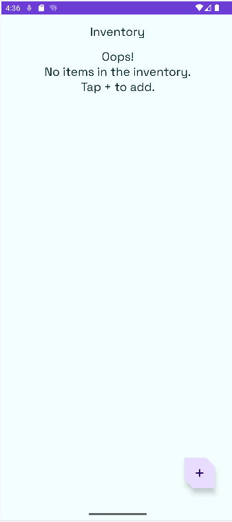
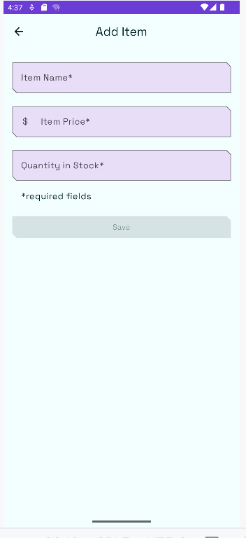

# 📚 **Inventory**
**Inventory** is a modern Android application that allows users to manage a local inventory including adding, editing, selling, and deleting items. This app demonstrates the use of modern Jetpack components including **Room**, **ViewModel**, **StateFlow**, and **Navigation**, and follows the **MVVM** architecture pattern. It leverages **Kotlin Coroutines** for asynchronous operations and persists data locally using an **SQLite database** via the Room persistence library.

## ✅ **LAST MAJOR UPDATES**

   - Implemented local database with Room : 
      - Creating the item entity representing a row in the "items" table.
      - Defining the ItemDao Dao with basic operations.
      - Implementing the InventoryDatabase class (singleton) to expose the DAO and manage the database via Room.
   - Connected `ItemsRepository` to Room DAO for real data operations.
   - Added functions for insert/update/delete in `OfflineItemsRepository`.
      
## ❌ **NEXT UPDATES**

   - Replace mock item list in `HomeScreen` with data from the local database.
   - Observe item list from database using `Flow` and display reactively.
   - Implement `ViewModelScope` coroutines for async DB operations.

## 📋 **Features**

   - 🗂 Manage inventory :

      - 🟩 **IN PROGRESS** Display inventory list stored locally in the Room database.
      - 🟩 **IN PROGRESS** Add new items with name, price, and quantity.
      - 🟩 **IN PROGRESS** Edit existing items via dedicated screen.
      - 🟩 **IN PROGRESS** Delete items permanently from local storage.
      - ❌ **NOT IMPLEMENTED** Sell item to decrease quantity.

   - 🎨 Modern and Fluid Interface:

      - ✅ **DONE** Follows Material Design 3 guidelines.
      - ✅ **DONE** Smooth transitions with Navigation Component.
      - ✅ **DONE** Responsive layout with adaptive UI.

      - TopBar:
         - ✅ **DONE** Display application title and possible future actions.

      - Light/Dark Mode:
         - ✅ **DONE** Supports **light/dark mode**.

      - Custom theme:
         - ✅ **DONE** Implemented custom colors and shapes.
         - ✅ **DONE** Implemented **Google font** "Space Grotesk".

   - 🔄 Real-time status management:

      - ❌ **NOT IMPLEMENTED** Use of StateFlow for UI state handling.
      - ✅ **DONE** ViewModel for lifecycle-aware logic.
      - 🟩 **IN PROGRESS** Coroutines for async data operations.

   - 📦 Data Persistence:

      - 🟩 **IN PROGRESS** Persist inventory data locally using Room (SQLite).
      - ❌ **NOT IMPLEMENTED** Automatically restore inventory after app restart.

   - 🧠 Architecture & Code Structure:

      - ✅ **DONE** MVVM architecture pattern.
      - ✅ **DONE** Clean separation between UI and business logic.

   - 🚀 Performance and responsiveness:
   
      - ❌ **NOT IMPLEMENTED** Optimize UI scrolling and animations.
      
   - 🛠 Error Handling & User Feedback:

      - ❌ **NOT IMPLEMENTED** UI instrumented tests.
      - ❌ **NOT IMPLEMENTED** ViewModel and Repository tests.

## 🛠️ **Tech Stack**

   - **Kotlin**: Modern, concise language for Android development.
   - **Jetpack Compose**: Declarative UI toolkit for Android.
   - **Material 3**: Modern, accessible user interface.
   - **Kotlin Flow**: Reactive streams for data.
   - **StateFlow**: Reactive state management for real-time updates.
   - **ViewModel**: MVVM architecture to separate business logic from user interface.
   - **Room**: Local database with DAO and entities;
   - **State Management**: Handle states with MutableStateOf.
   - **Navigation Component**: Seamless screen transitions.
   - **Coroutines**: Async programming made simple.
   
## 🚀 **How to Use**
   
   - ❌ **This section has not been implemented yet.**

## 📸 **Screenshots**

   - **Home screen**:
   
      

   - **Item edit screen**:
   
      

## 🤝 **Contributions**
Contributions are welcome! Feel free to fork the repository and submit a pull request for new features or bug fixes✅🟩❌.