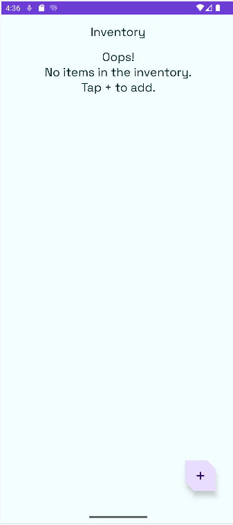
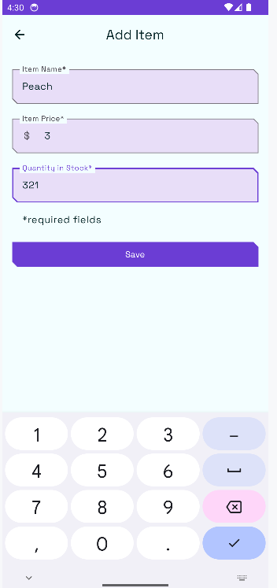
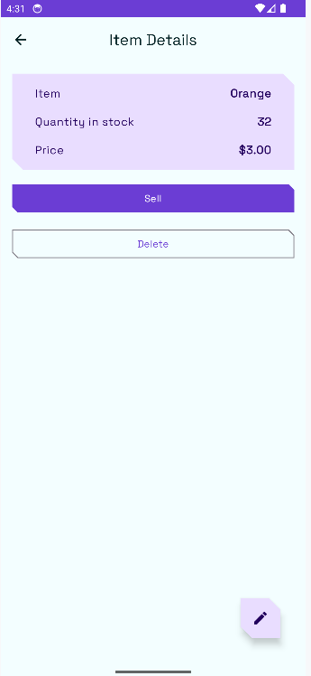
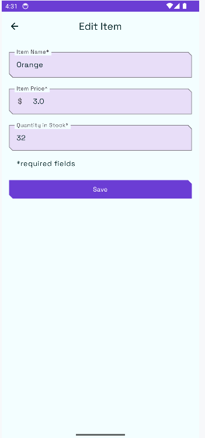

# 📚 **Inventory**
**Inventory** is a modern Android application that allows users to manage a local inventory including adding, editing, selling, and deleting items. This app showcases modern Android development practices using Jetpack components including **Room**, **ViewModel**, **StateFlow**, and **Navigation**, and follows the **MVVM** architecture pattern. It leverages **Kotlin Coroutines** for asynchronous operations and persists data locally using an **SQLite database** via the Room persistence library.

## ✅ **LAST MAJOR UPDATES**

   - Added edit item functionality via `ItemEditViewModel` and update UI screen.
   - Add delete item support from item detail or list view.
   - Implement sell item logic to decrease quantity.
   - Enable data restoration after app restart using SavedStateHandle.
   - Deployed Signed APK for install the application in release mode.
      
## ❌ **NEXT UPDATES**

   - This app is now finish.

## 📋 **Features**

   - 🗂 Manage inventory :

      - ✅ **DONE** Display inventory list stored locally in the Room database.
      - ✅ **DONE** Add new items with name, price, and quantity.
      - ✅ **DONE** Edit existing items via dedicated screen.
      - ✅ **DONE** Delete items permanently from local storage.
      - ✅ **DONE** Sell item to decrease quantity.

   - 🎨 Modern and Fluid Interface:

      - ✅ **DONE** Follows Material Design 3 guidelines.
      - ✅ **DONE** Smooth transitions with Navigation Component.
      - ✅ **DONE** Responsive layout with adaptive UI.

      - TopBar:
         - ✅ **DONE** Display application title and possible future actions.

      - Light/Dark Mode:
         - ✅ **DONE** Supports **light/dark mode**.

      - Custom theme:
         - ✅ **DONE** Implemented custom colors and shapes.
         - ✅ **DONE** Implemented **Google font** "Space Grotesk".

   - 🔄 Real-time status management:

      - ✅ **DONE** Use of StateFlow for UI state handling.
      - ✅ **DONE** ViewModel for lifecycle-aware logic.
      - ✅ **DONE** Coroutines for async data operations.

   - 📦 Data Persistence:

      - ✅ **DONE** Persist inventory data locally using Room (SQLite).
      - ✅ **DONE** Automatically restore inventory after app restart.

   - 🧠 Architecture & Code Structure:

      - ✅ **DONE** MVVM architecture pattern.
      - ✅ **DONE** Clean separation between UI and business logic.

   - 🚀 Performance and responsiveness:
   
      - ✅ **DONE** Optimize UI scrolling and animations.
      
   - 🛠 Error Handling & User Feedback:

      - ✅ **DONE** : Validates Room DAO operations with in-memory database.

## 🛠️ **Tech Stack**

   - **Kotlin**: Modern, concise language for Android development.
   - **Jetpack Compose**: Declarative UI toolkit for Android.
   - **Material 3**: Modern, accessible user interface.
   - **Kotlin Flow**: Reactive streams for data.
   - **StateFlow**: Reactive state management for real-time updates.
   - **ViewModel**: MVVM architecture to separate business logic from user interface.
   - **Room**: Local database with DAO and entities;
   - **State Management**: Handle states with MutableStateOf and StateFlow.
   - **Navigation Component**: Seamless screen transitions.
   - **Coroutines**: Async programming made simple.
   
## 🚀 **How to Use**
   
1. **Launch the App**:
   - Download the "app-release.apk" file find in \app\release\ .
   - Install the file in your smartphone or in an emulator. (Good performance because in Release Build Variant)
   - If you want to use android studio, download the code and launch the app on an Android device or emulator. (Bad performance because in Debug Build Variant)
2. **Use The + Button on the HomeScreen**:
   - The HomeScreen displays message in case of no item adding.
   - Click on the Button on the down/right side with the "+".
3. **Add caracteritics of the item that you want to add**:
   - Fill all the fields (name, price, quantity)
   - Click on save to save your item in the database.
4. **Return to the HomeScreen and see your item are stored**:
   - The save button clicking will return you automatically on the HomeScreen
   - You can now see the item displays on the HomeScreen.
   - Continue to add and store items.
5. **See the details of items, and modify them**
   -click on an item for see it details.
   -click on the floating button to modify it details.
   -click on sell to decrease the amount of item.
   -click on delete to delete the item from the app and the database.
6. **Enjoy the App**

## 📸 **Screenshots**

   - **Home screen**:
   
      

      

   - **Item entry screen**:
   
      

      

   - **Item details screen**:
   
      

   - **Item edit screen**:

      

## 🤝 **Contributions**
Contributions are welcome! Feel free to fork the repository and submit a pull request for new features or bug fixes✅🟩❌.